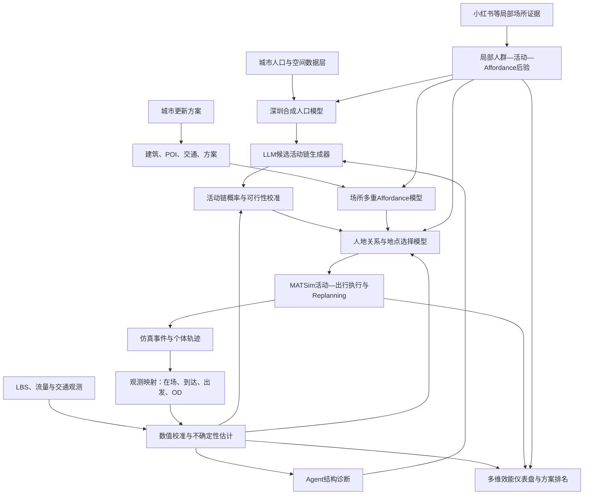
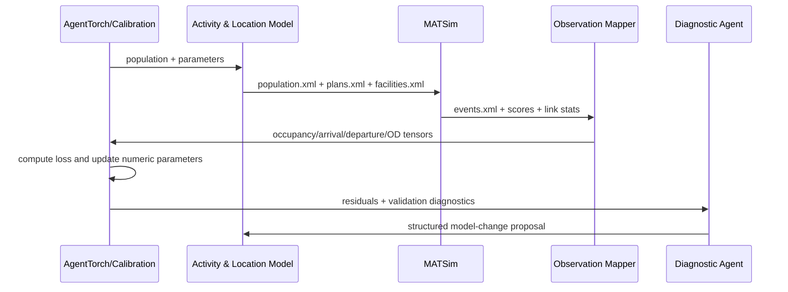

# 深圳活动人口与人地关系模拟系统总体研究与技术设计报告

## 摘要

本项目拟建设一套面向城市更新与城市设计方案比选的活动人口模拟和决策支持系统。系统不以单纯预测热力图为终点，而以解释和模拟“什么人、在什么时间、基于什么活动目的、为什么选择某个场所、形成何种群体效应”为核心。总体技术路线是：基于人口普查、人口画像和移动观测数据构建深圳合成人口；利用大语言模型生成受约束的工作日与周末候选活动链；通过人群—活动—场所—时间条件下的多重 affordance（可供性）和地点选择模型，把活动映射到地块与设施；使用 MATSim 执行个体活动—出行计划并产生交通、拥堵、时刻调整和群体共现反馈；再将仿真事件转换为与 LBS 在场人口、到达量、出发量及可获得 OD 相同口径的观测量，通过数值优化器校准参数，并由 Agent 诊断结构性偏差。对于重点更新地区，系统进一步利用小红书等公开场所内容提取人群、活动、动机和场所使用语义，在纠正平台偏差后形成局部精细化人口后验。最终产品输出活动生成模型、人地关系模型、场所 affordance 结构、方案影响机制、分人群活动链及多维效能排名，并以不确定性和适用边界约束决策结论。

**关键词：** 活动型模型；合成人口；MATSim；大语言模型；人地关系；场所 affordance；城市更新；群体智能；深圳

---

## 1. 报告定位

### 1.1 项目定位

本项目首先是一套**规划决策工具**，随后可发展为关于“群体智能赋能的城市设计效能研判”的研究与论文体系。

产品的首要输出不是一张预测热力图，而是：

1. 深圳不同人群在工作日和周末的活动生成模型；
2. 不同人群选择具体地块、设施和场所的可解释人地关系模型；
3. 场所承载的多重 affordance 及其对不同人群的实际有效性；
4. 城市更新方案实施后的人群规模、来源、类型、活动链和交通反馈；
5. 多方案的多维效能仪表盘、可调权重排名、Pareto 前沿和排名稳定性；
6. 每个方案优劣的机制解释、证据来源、不确定性和适用边界。

### 1.2 核心研究对象

研究对象不是静态“城市活力值”，而是由以下过程共同生成的**活动人口系统**：

> 人口属性与需求  
> → 活动链生成  
> → 场所感知与地点选择  
> → 活动—出行执行  
> → 多人共现与交通反馈  
> → 可观测的在场人口、流量和场所使用结构  
> → 规划方案效能

因此，“活力”在本项目中是群体行为的一个涌现结果，而不是一个独立、自解释的标签。

### 1.3 不应做出的过度承诺

在缺少真实更新项目实施后数据、严格准实验或随机实验的情况下，系统输出应称为：

- 校准后的反事实仿真；
- 方案相对效能估计；
- 机制一致性预测；
- 条件于模型假设和数据范围的决策支持。

不应直接称为严格因果预测，也不应把模型生成的精确人数当作无误差事实。

---

## 2. 当前基础、数据条件与能力边界

## 2.1 当前代码原型

当前仓库已经包含 `agent_torch.models.urban_vitality_shenzhen` 原型，而不是从零开始。根据项目内 [PROGRESS.md](../../PROGRESS.md)，当前模型具有以下基础：

| 项目 | 当前状态 |
|---|---|
| 空间单元 | 3,023 个深圳街坊 |
| 时间单元 | 工作日 24 小时 + 周末 24 小时，共 48 个时段 |
| 人群表示 | 每街坊 4 个宽泛年龄群体 |
| 输入特征 | 78 个静态特征 + 96 个到达/出发时序特征，共 174 个 |
| 观测目标 | 街坊级 LBS 在场人口 |
| 当前行为结构 | 留家概率、街坊吸引力、空间注意力、街坊时序尺度修正 |
| 校准方式 | AgentTorch 可微仿真与梯度训练 |
| 场景功能 | 支持建筑、POI 特征扰动及方案差值输出 |

当前原型已经证明：街坊特征、人口画像与到达/出发特征能够较好解释深圳街坊活力的排序结构。但它仍属于“观测拟合＋特征扰动”模型，尚未具备真实的个体活动链、完整地点选择、MATSim 活动出行执行和局部社交媒体后验校准。

### 2.1.1 当前结果应如何理解

现有多随机种子验证 MAE 约为 `1337 ± 74`，排序表现较强；行政区留出验证的加权 Spearman 约为 `0.899`。但 GBT 在若干设置下优于当前 AgentTorch 模型，南山区留出实验还出现了全局 softmax 把人口错误集中到少数街坊的失稳现象。

这个反例非常重要。它说明：

- 当前模型适合作为基线和数据管道；
- 仅凭街坊吸引力和宏观到达/出发特征不足以形成可靠的人地机制；
- 下一阶段必须显式表示活动目的、出发地、候选目的地、容量、时刻和交通成本；
- 新系统必须保留强机器学习基线，而不能因“Agent”形式更复杂就默认其更正确。

## 2.2 已核对的数据

### 2.2.1 街坊级综合数据

`街坊_数据连接.csv` 包含约 3,054 条原始记录，字段覆盖：

- 面积、密度、容积率；
- 建筑高度、层数、总建筑面积、基底面积和建筑数量；
- 交通、住宅、商业、办公、教育、医疗、文化等建筑面积；
- 工业、公共服务、生态、绿地、交通设施、商业和居住等用地；
- 地铁数量、地铁距离、道路密度、道路等级；
- 边界、海岸、快速路、山体等区位条件；
- 年龄、教育和人口总量等聚合画像。

### 2.2.2 LBS 在场人口

`街坊_LBS统计.csv` 包含 3,023 个街坊的：

- `WD_C_00`—`WD_C_23`：工作日逐小时在场人口；
- `WE_C_00`—`WE_C_23`：周末逐小时在场人口。

该数据表达的是某地某时段的**人口存量或在场强度**，不是从一个地方到另一个地方的流量。

### 2.2.3 人口画像

`街坊_人口画像.csv` 包含：

- 5 岁年龄组；
- 性别；
- 教育程度；
- 户籍与常住人口；
- 居住时间；
- 人口密度与就业人口等字段。

这些数据可用于构造合成人口的边际约束，但要先核对字段口径、年份和空间对应关系。

### 2.2.4 到达与出发数据

当前已聚合的移动数据来自约 90,417 个细网格，覆盖：

- 工作日与周末；
- 到达与出发；
- 每类 24 个小时。

当前数据可以约束：

\[
O_{g,t}=\text{网格 }g\text{ 在时段 }t\text{ 的出发量}
\]

\[
D_{g,t}=\text{网格 }g\text{ 在时段 }t\text{ 的到达量}
\]

但如果没有成对的起点—终点记录，它并不是完整的：

\[
T_{ij,t}=\text{时段 }t\text{ 从 }i\text{ 到 }j\text{ 的人数}
\]

因此，本报告把当前数据称为**OD 边际或到达/出发流量**。它能够约束哪里产生出行和哪里吸引出行，但不能独立识别每一条 \(i\rightarrow j\) 联系。

### 2.2.5 POI、AOI、建筑和交通

数据目录包含多年份 POI/AOI、建筑轮廓、交通、土地利用、公共服务设施、小区、城中村、蓝绿空间和人口等数据。正式建模前需要建立统一的数据登记表，记录每个数据集的年份、来源、坐标系、字段含义、许可、缺失率和空间覆盖。

### 2.2.6 待采集的局部场所数据

计划使用公开小红书笔记及其文本、图像、时间和地点线索提取：

- 到访地块或场所；
- 活动类型及活动组合；
- 行为型人群；
- 同行关系；
- 到访动机；
- 使用时段；
- 正负体验；
- 被感知和被实际使用的场所 affordance。

该数据是**局部行为语义证据**，不能直接当作真实客流计数。

## 2.3 各数据源的职责分工

| 数据源 | 主要回答的问题 | 不适合直接回答的问题 |
|---|---|---|
| 七普与人口画像 | 本地潜在人口是谁、住在哪里 | 某一时刻具体在哪里活动 |
| LBS 在场人口 | 某地某时有多少人在场 | 这些人具体是谁、为什么来 |
| 到达/出发边际 | 哪里产生和吸引流动 | 每条起终点联系，除非有成对 OD |
| 完整成对 OD | 人从哪里到哪里 | 活动目的与场所体验 |
| POI/AOI/建筑/交通 | 场所供给、容量、形态和可达性 | 实际发生了什么活动 |
| 小红书等场所内容 | 谁来、做什么、为什么来、如何感知场所 | 总体真实人数 |
| 城市更新方案 | 哪些空间与功能变量将发生变化 | 人群如何响应，需要模型推断 |

一句话概括：

> LBS 与流量数据主要提供“多少、何时、哪里”，社交媒体主要提供“谁、做什么、为什么”，建筑与 POI 提供“场所能够支持什么”。

---

## 3. 理论与方法基础

## 3.1 Activity-based model

活动型模型把出行视为开展活动的派生需求。个体一天由一系列 activity 与连接活动的 leg 构成，而不是若干相互独立的 OD 记录。Belaroussi 和 Delhoum（2024）<!--ref:belaroussi2024--><!--anchor:section:3-->在未来城区预测中将居民、外部工作/就学者和访客分开，先生成 primary/secondary activities，再把设施吸引力用于次要活动地点选择，最后交由 MATSim 执行。

这篇论文最值得借鉴的不是其具体吸引力权重，而是四个结构：

1. 区分居民、外部固定使用者和访客；
2. 区分主活动和次要活动；
3. 把活动链生成与活动地点选择拆开；
4. 用区域模型为局部场地提供边界流量。

其不足也必须保留：部分地块潜力由专家赋值，活动潜力来自较粗调查比例，验证主要依靠平均出行距离，缺少精细 LBS 和实施后数据。深圳项目应把这些启发改造为可学习、可验证的参数体系。

另一条可借鉴路线是从聚合 OD 与人口属性反演个体活动日程。Choi、Seo 和 Hohl（2025）<!--ref:choi2025abts--><!--anchor:section:Abstract-->展示了把聚合 OD 按人口和出行目的分解为个体日程的 agent-based travel scheduler；但该思路仍要求足够的 OD 结构信息，不能把只有到达/出发边际的数据误当成完整 OD。

## 3.2 LLM 活动生成

Wang 等（2024）<!--ref:wang2024llmob--><!--anchor:section:3-->提出的 LLMob 通过真实活动数据、自一致性和检索增强生成可解释的个人活动轨迹，说明 LLM 可以承担活动语义、动机和活动链假设生成。MobGLM 则探索了人口属性与活动序列之间的生成关系（Zhang et al., 2024）<!--ref:zhang2024mobglm--><!--anchor:section:Abstract-->。

但 LLM 不应直接充当未经校准的“真实人类”。FLAIR 的研究显示，纯提示驱动的 LLM 在细粒度活动语义推断中不够可靠，规则、机器学习和 LLM 的分层混合更稳健（Lyu et al., 2026）<!--ref:lyu2026flair--><!--anchor:section:Abstract-->。因此，本项目采用：

> LLM 生成行为先验和结构候选  
> ＋ 规则保证时空可行性  
> ＋ 数据模型估计概率与参数  
> ＋ MATSim 检验活动出行可执行性

## 3.3 MATSim 的位置

MATSim 是本项目的**活动—出行仿真执行底座**。它负责：

- 执行个体活动计划；
- 在交通网络上分配路径；
- 形成拥堵和旅行时间反馈；
- 调整出发时间、方式和计划；
- 输出活动开始、活动结束、出发、到达和路段事件。

MATSim 官方文档说明，replanning 的 `StrategyModule` 可以改变路径、时间、活动序列和活动位置（MATSim Contributors, 2026）<!--ref:matsimReplanning--><!--anchor:section:Detailed%20Description-->；其 destination innovation 也把目的地选择视为受时间预算、空间容量和其他个体竞争约束的优化问题（Horni et al., 2016）<!--ref:horni2016matsim--><!--anchor:page:155-160-->。

因此，系统不是“LLM 给出家—购物—电影—家后，标准 MATSim 自动猜地点”，而是：

> LLM 活动链  
> → 人地关系模型确定候选设施或把地点选择嵌入 replanning  
> → MATSim 执行与迭代  
> → 事件聚合  
> → LBS/流量校准

## 3.4 Differentiable population simulation

AgentTorch 支持张量化、可微的 agent-based simulation，可用于从宏观观测反向校准微观行为参数（Chopra et al., 2023）<!--ref:chopra2023agenttorch--><!--anchor:section:Abstract-->。在本项目中，AgentTorch 不替代 MATSim 的交通仿真，而更适合承担：

- 合成人口的批量状态表达；
- 活动链概率与人地效用参数；
- 可微近似模型；
- 多源损失函数；
- 梯度校准；
- 快速方案筛选和 MATSim surrogate。

MATSim负责高保真活动交通执行，AgentTorch负责大规模参数学习和快速反演，两者形成混合系统。

## 3.5 Affordance 作为人地关系中介

affordance 应被理解为环境与行动者之间的关系，而不是地块固定标签。公共空间研究已经把 affordance 用于回答“谁能够在这里做什么、由什么空间条件支持”，并指出实际 affordance 既可能由设计意图产生，也可能在使用中意外涌现（Widmer & Rérat, 2025）<!--ref:widmer2025affordance--><!--anchor:section:Abstract-->。

因此，同一商业地块可同时提供：

- 消费；
- 餐饮；
- 社交；
- 休息；
- 身份展示；
- 夜生活；
- 文化体验；
- 亲子陪伴；
- 临时工作；
- 通行与换乘。

项目不再建立“商业用地＝购物活动”的一对一映射，而建立“人群—活动—场所—时间”的多对多关系。

---

## 4. 核心概念模型

## 4.1 三层 affordance

为避免把规划意图等同于真实使用，定义三层 affordance：

### 4.1.1 设计供给 affordance

由方案和建成环境提供的潜在行动条件，例如：

- 楼面规模；
- 首层界面和可进入性；
- 商业、文化、休闲和服务设施；
- 遮阴、座椅、步行空间；
- 灯光、营业时间；
- 可见性、可达性；
- 室内外连续性；
- 活动容量。

记作：

\[
\mathbf A^{design}_{j,t}
\]

### 4.1.2 感知 affordance

不同人群对同一场所的可用性、吸引力和社会意义不同：

\[
\mathbf A^{perceived}_{g,j,a,t}
=
h(
\mathbf A^{design}_{j,t},
\mathbf z_g,
a,
\text{社会情境}_{j,t}
)
\]

例如，夜间灯光对夜生活人群可能是吸引力，对带幼儿家庭则可能没有同等效用。

### 4.1.3 实现 affordance

真实或仿真中最终发生的活动：

\[
\mathbf A^{enacted}_{j,t}
\]

它由选择、交通、容量、拥挤、其他人群共现和偶发事件共同决定。小红书笔记、访谈、行为观察和活动语义数据主要用于观察这一层。

## 4.2 人群不是只有人口统计属性

系统应同时保留两套人群描述：

1. **人口统计属性**：年龄、家庭结构、就业、教育、居住地等；
2. **行为型人群**：通勤者、亲子家庭、夜间娱乐者、本地青年、游客、打卡型访客、日常生活服务使用者等。

行为型人群不能完全由年龄或性别决定，而应由人口属性、活动链和场所使用共同识别。

## 4.3 活动与 affordance 分开

“看电影”是活动；“娱乐、社交、身份展示、休息”是它可能调用的 affordance。一个活动可以同时使用多个 affordance，一个 affordance也可以支持多种活动。

因此，每个活动 episode 至少应包含：

```yaml
activity_type: cinema
start_window: [18:30, 20:00]
duration_distribution: [120, 150]
mandatory: false
required_affordances:
  entertainment: 0.9
  social: 0.6
  identity_display: 0.3
time_flexibility: 0.4
location_flexibility: 0.5
companion_type: friends_or_partner
```

---

## 5. 总体系统架构



## 5.1 两个闭环

### 模型可信度闭环

> 生成 → 仿真 → 观测映射 → 与真实数据比较 → 参数校准 → 留出验证

目标是建立能解释现实数据且能在未参与校准的数据上保持稳定的模型。

### 规划决策闭环

> 方案输入 → 空间与 affordance 改变 → 行为响应 → 群体涌现 → 多维效能 → 设计调整

目标是解释“哪种设计变量通过什么行为机制影响哪些人群”，而不只是给方案打一个总分。

## 5.2 三种群体智能

本项目中的“群体智能”应有清晰的技术含义：

1. **人口群体智能**：大量异质个体的活动选择与互动形成城市尺度涌现；
2. **模型群体智能**：多个功能 Agent 分别生成假设、分析残差、检查偏差和解释方案；
3. **人机协同智能**：规划者调整价值权重、审查模型证据并作最终判断。

数值参数的优化应由优化器完成，Agent 负责提出结构性修改，不应让 LLM 无约束地直接“调参数直到拟合”。

---

## 6. 模块设计

## 6.1 模块 A：深圳合成人口

### 目标

生成与七普、人口画像和空间分布约束一致的个体或代表性 agent。

### 人口角色

建议至少区分：

- 本地居民；
- 外部就业者；
- 外部学生；
- 日常访客；
- 跨区休闲/消费访客；
- 商务访客；
- 游客；
- 更新场地新增居民。

### 方法

V1 可使用 IPF/IPU、迭代重加权或概率图模型生成个体；V2 可使用生成模型补充高维联合分布。每个 agent 带权重，以抽样人口代表真实规模。

### 输出

```yaml
person_id: P000001
weight: 32.4
home_zone: B1023
role: resident
age_group: 25_34
household_type: couple_no_child
employment_status: employed
car_ownership: 0
behavioral_archetype_prior:
  commuter: 0.62
  leisure_explorer: 0.28
  nightlife: 0.10
```

### 验收

- 各空间层级人口边际误差；
- 人口属性联合分布误差；
- 家庭约束一致性；
- 不同抽样率下统计稳定性。

## 6.2 模块 B：LLM 活动链生成器

### 目标

为不同人群、工作日/周末和场景生成多个候选活动链及先验概率。

### 原则

- 不让 LLM 为每个人只生成唯一答案；
- 不直接接受自然语言文本作为仿真输入；
- 使用活动本体、JSON Schema 和时空规则；
- 使用真实调查、已有活动模式和局部证据做 few-shot/RAG；
- 先批量生成 archetype-level 候选，再分配给人口，避免每个 agent 都调用 LLM；
- 每条链必须通过时间、持续时长、角色资格和交通可行性检查。

### 概率表示

令 LLM 提供候选链先验 \(q_{\mathrm{LLM}}\)，再通过可学习参数校准：

\[
P(s\mid \mathbf z_g,d)
\propto
\exp
\left[
\eta\log q_{\mathrm{LLM}}(s\mid\mathbf z_g,d)
+\boldsymbol\theta^\top\mathbf f(s,\mathbf z_g,d)
\right]
\]

其中：

- \(s\)：活动链；
- \(\mathbf z_g\)：人群属性；
- \(d\)：工作日、周末或特殊日；
- \(\eta\)：对 LLM 先验的信任程度；
- \(\mathbf f\)：链长度、活动次数、时段、持续时长等特征。

### 输出

每类人群输出：

- 候选活动链集合；
- 概率；
- 每个活动的时间窗和持续时间分布；
- 活动的必选/可选属性；
- 模式、同伴和地点灵活性；
- 所需 affordance。

## 6.3 模块 C：场所 affordance 模型

### 目标

把建筑、POI、交通、空间设计和社交媒体语义转换为场所能够支持的多维行动可能性。

### 基础 affordance 维度

建议从可扩展本体开始：

| 维度 | 可能的空间证据 |
|---|---|
| 日常消费 | 零售、超市、生活服务、价格层级 |
| 餐饮 | 餐饮类型、营业时间、座位与外摆 |
| 社交 | 可停留空间、座椅、界面开放度、人群共现 |
| 休息 | 遮阴、绿地、安静度、座椅、步行连续性 |
| 身份展示 | 场所意象、稀缺体验、景观、品牌、拍照点 |
| 夜生活 | 夜间营业、照明、酒吧娱乐、夜间交通 |
| 文化体验 | 展览、演出、历史文化、创意设施 |
| 亲子 | 儿童设施、安全、家庭服务、厕所 |
| 运动 | 体育设施、慢行、开放空间 |
| 工作学习 | 办公、共享空间、学校、咖啡与网络 |

affordance 随时间、方案、人群和在场者构成变化，不是一个静态地块分数。

### 方法路径

- V1：专家本体＋特征工程＋监督/半监督学习；
- V2：多任务学习，同时预测活动类型、动机和停留；
- V3：图神经网络或多模态地块编码器；
- 社交媒体作为 realized affordance 的弱标签；
- 现场调查或人工标注集作为高质量锚点。

## 6.4 模块 D：人地关系与地点选择

### 目标

解释个体为什么选择场所 A 而不是 B。

### 候选集

候选地点必须先满足：

- 能支持目标活动；
- 在可接受的旅行时间预算内；
- 营业时间匹配；
- 容量非零；
- 符合角色和年龄资格；
- 与活动链前后地点可连接。

### 效用函数

\[
\begin{aligned}
U_{i,j,a,t}=&\
\boldsymbol\beta_{g,a}^{\top}\mathbf x_j
+\boldsymbol\omega_{g,a}^{\top}\mathbf A_{j,t}\\
&-\lambda_{g,a}C_{i,j,t}
+\gamma_{g,a}\text{CoPresence}_{j,t}\\
&-\delta_{g,a}\text{Crowding}_{j,t}
+\rho_{g,a}\text{Familiarity}_{i,j}
+\epsilon_{i,j,a,t}
\end{aligned}
\]

其中：

- \(\mathbf x_j\)：建筑、POI、交通、容量等可观测属性；
- \(\mathbf A_{j,t}\)：多维 affordance；
- \(C\)：旅行时间、费用、换乘等广义成本；
- `CoPresence`：期望遇到某些人群的正向社会效应；
- `Crowding`：过度拥挤的负向效应；
- `Familiarity`：熟悉度、惯性和地方依恋。

地点选择概率可从 mixed logit 起步：

\[
P(j\mid i,a,t)
=
\frac{\exp(U_{i,j,a,t})}
{\sum_{k\in\mathcal C_{i,a,t}}\exp(U_{i,k,a,t})}
\]

### 模型比较

| 模型 | 用途 |
|---|---|
| 规则/重力模型 | 最低基线 |
| Multinomial/Mixed Logit | 可解释主模型基线 |
| 决策树、Random Forest、GBT | 非线性强基线和特征重要性 |
| 神经效用模型 | 高维交互和多任务预测 |
| 图神经网络 | 设施网络、邻近与空间关系 |
| MATSim 内嵌 replanning | 动态拥堵、容量和重复选择 |

推荐 V1 以 mixed logit 与 GBT 双基线起步；在识别出稳定变量后再升级神经模型。

## 6.5 模块 E：MATSim 执行层

### 输入

- 道路和公共交通网络；
- 合成人口；
- 带坐标或 facility ID 的活动计划；
- 模式、时刻、容量和 scoring 参数；
- 更新方案改变后的设施与网络。

### 输出事件

- `ActivityStart` / `ActivityEnd`；
- `PersonDeparture` / `PersonArrival`；
- 路段进入与离开；
- 模式、路径、旅行时间；
- 计划 score、重规划和未完成事件。

### 两阶段集成

**V1：外部地点选择＋MATSim执行**

人地关系模型先给出初始目的地，再把完整计划写入 MATSim。优点是开发快、可解释、便于独立测试。

**V2：地点选择嵌入 MATSim replanning**

把人地效用作为自定义 strategy，使个体在拥堵、容量和其他人群变化后重新选择地点。优点是反馈更完整，但计算和识别难度更高。

长期推荐混合方式：外部模型产生高质量初始计划，MATSim 只在受约束的候选集中进行有限重规划。

## 6.6 模块 F：观测映射

MATSim 的个体事件不能直接与热力图比较，必须先转换成相同口径。

### 在场人口

\[
\hat H_{g,t}
=
\sum_i w_i
\mathbb I
\left(
\text{person }i
\text{在时段 }t\text{ 于网格 }g\text{ 开展活动}
\right)
\]

### 出发量

\[
\hat O_{g,t}
=
\sum_i w_i
\mathbb I(\text{person }i\text{ 从 }g\text{ 出发})
\]

### 到达量

\[
\hat D_{g,t}
=
\sum_i w_i
\mathbb I(\text{person }i\text{ 到达 }g)
\]

### 成对 OD

如果后续获得真实成对 OD：

\[
\hat T_{ij,t}
=
\sum_n w_n
\mathbb I(o_n=i,d_n=j,t_n=t)
\]

LBS 与仿真人数可能存在采样率、设备覆盖和时段偏差，因此还需要显式观测模型，而不是简单要求两者数值完全相等。

## 6.7 模块 G：多源校准

综合损失可写为：

\[
\begin{aligned}
\mathcal L=&\
w_H\mathcal D_H(H,\hat H)
+w_O\mathcal D_O(O,\hat O)
+w_D\mathcal D_D(D,\hat D)\\
&+w_{OD}\mathcal D_{OD}(T,\hat T)
+w_S\mathcal D_S(Y^{social},\hat Y^{social})\\
&+\lambda_1 R_{\mathrm{chain}}
+\lambda_2 R_{\mathrm{capacity}}
+\lambda_3 R_{\mathrm{complexity}}
\end{aligned}
\]

其中：

- \(\mathcal D_H\)：Huber、Poisson deviance、相对误差和时序形状误差；
- \(\mathcal D_O,\mathcal D_D\)：到达/出发边际误差；
- \(\mathcal D_{OD}\)：成对 OD 误差；
- \(\mathcal D_S\)：局部人群—活动—场所语义误差；
- \(R_{\mathrm{chain}}\)：避免活动链概率偏离可靠先验过远；
- \(R_{\mathrm{capacity}}\)：容量、时间和设施资格违规；
- \(R_{\mathrm{complexity}}\)：控制模型复杂度和参数漂移。

### 校准顺序

1. 合成人口边际校准；
2. 活动链频率与时序校准；
3. 静态地点选择校准；
4. MATSim 交通与时刻参数校准；
5. LBS、到达/出发和局部语义联合校准；
6. 留出地区、时段和场所验证。

不建议一开始就端到端同时优化所有参数，否则不同机制可能互相补偿，得到“拟合正确但机制错误”的结果。

## 6.8 模块 H：Agent 诊断与结构修改

Agent 应读取残差地图、分人群误差、时序误差、容量违规和对照实验，输出结构化诊断：

```yaml
diagnosis_id: D-012
evidence:
  - weekend_night_underprediction_in_cluster_7
  - high_xhs_nightlife_share
suspected_cause:
  type: missing_activity_chain
  group: young_adults
proposal:
  add_chain: home-dining-nightlife-home
  expected_effect: increase_20_00_to_01_00_presence
validation_required:
  - heldout_weekend
  - neighboring_blocks
```

建议的 Agent 角色：

| Agent | 职责 |
|---|---|
| 活动假设 Agent | 提出活动链、动机和 affordance 候选 |
| 证据提取 Agent | 从论文和局部内容提取结构化证据 |
| 残差诊断 Agent | 分析时空、人群和活动残差 |
| 结构修订 Agent | 提出增删人群、活动或效用项 |
| 验证守门 Agent | 检查留出集、消融和数据泄漏 |
| 方案解释 Agent | 将反事实结果转换为规划机制说明 |

每项 Agent 建议必须经数值实验和验证守门后才能进入正式模型。

---

## 7. 局部区域精细化人口模拟

## 7.1 双尺度架构

城市人类移动 ABM 的系统综述指出，现有研究更多集中在区域和城市尺度，对街道等精细尺度的探索相对不足（Divasson-J. et al., 2025）<!--ref:divasson2025review--><!--anchor:section:Abstract-->。本项目因此不把全市与场地模型压缩成一个分辨率，而采用相互传递边界条件的双尺度架构。

城市级模型解决：

- 哪些人可能进入目标地区；
- 从哪里来；
- 总体规模和时段；
- 外部交通条件。

局部模型解决：

- 具体是什么行为型人群；
- 使用哪个地块或设施；
- 做什么活动；
- 使用哪些 affordance；
- 为什么选择这里；
- 人群之间如何共现、避让或竞争。

## 7.2 小红书数据处理流程


### 标签建议

每条场所证据至少包含：

```yaml
post_id_hash: ...
place_id: ...
time_bucket: weekend_afternoon
activity_types: [coffee, photography, socializing]
behavioral_groups: [young_local, tourist]
companion: friends
motivations: [relaxation, identity_display]
affordances:
  social: 0.8
  rest: 0.5
  identity_display: 0.9
confidence: 0.74
```

### 小红书数据的统计角色

设某类人群—活动—场所的真实在场量为 \(N_{g,a,j,t}\)，平台上观察到的笔记量为 \(C_{g,a,j,t}\)。两者之间还存在发帖倾向 \(\rho\)：

\[
C_{g,a,j,t}
\sim
\text{Poisson}
\left(
\rho_{g,a,j,t}N_{g,a,j,t}
\right)
\]

因此，原始笔记数不能直接替代 \(N\)。在无法可靠估计 \(\rho\) 时，社交媒体数据优先用于：

- 活动类型存在性；
- 人群和活动的相对组成；
- 动机和 affordance；
- 场所间相对差异；
- 事件与时间模式。

总人数仍由 LBS、到达/出发和容量约束控制。

## 7.3 局部后验更新

\[
P(g,a,s\mid j,t,\mathcal D)
\propto
P_{\mathrm{city}}(g,a,s\mid j,t)
\cdot
L_{\mathrm{LBS/flow}}
\cdot
L_{\mathrm{social}}
\]

城市模型给出先验，局部数字痕迹修正人群和活动语义，LBS 与流量控制数量。该结构比“直接用小红书训练人口模型”更稳健。

## 7.4 偏差与伦理

地理社交媒体用户通常不是总体人口的随机样本，且不同群体的发帖倾向不同。Niu 和 Silva（2023）<!--ref:niu2023socialmedia--><!--anchor:section:Abstract-->展示了社交媒体用于城市活动时空分析的价值，同时把非代表性用户和活动语义缺失列为核心问题。

本项目应遵守：

- 只处理公开、研究所需的信息；
- 不建立个体追踪档案；
- 使用哈希 ID 和空间时间聚合；
- 不从面部推断种族、健康、宗教、性取向或精确收入等敏感属性；
- 年龄等属性优先使用自述和上下文，不以人脸识别作为核心方法；
- 建立爬取范围、保留期限、删除机制和人工访问权限；
- 论文发表时披露平台偏差、采样机制和数据处理边界；
- 根据所在机构要求完成伦理审查或豁免确认。

---

## 8. 城市更新方案的反事实模拟

## 8.1 方案输入

每个方案不能只输入“方案 A/B/C”，而应转换为可计算的变化：

- 建筑面积、容积率、建筑高度和首层界面；
- 住宅、商业、办公、文化、教育和公共空间规模；
- POI 类型、数量、质量和营业时间；
- 地铁、公交、道路和步行连接；
- 公园、广场、绿地、座椅、遮阴和夜间照明；
- 设施容量、价格或服务层级；
- 场所品牌、活动运营和事件安排；
- 开发时序和临时施工影响。

这些变量首先改变设计 affordance，再影响地点效用、活动链可行性和 MATSim 交通反馈。

## 8.2 需要输出的方案结果

对于每个方案，至少输出：

1. 总到访人口及置信区间；
2. 本地居民、外部就业者、学生、游客和其他访客数量；
3. 分人群、分年龄/家庭和分行为 archetype 的构成；
4. 主要来源地区和到达时段；
5. 主要活动链及其概率；
6. 各地块承载的活动与 affordance；
7. 停留时间和访问频次；
8. 出行方式、旅行时间和拥堵影响；
9. 场地内部与周边街坊的活力变化；
10. 新增活力与从周边转移的活力；
11. 群体共现、包容性和可能的排斥；
12. 方案排名、排名敏感性和不确定性。

## 8.3 多维效能仪表盘

建议设置以下一级维度：

| 维度 | 典型指标 |
|---|---|
| 活动规模 | 日均到访、峰值、停留人时 |
| 活动多样性 | 活动类型熵、活动链多样性、affordance 覆盖 |
| 人群包容性 | 人群多样性、年龄与家庭覆盖、弱势群体可达性 |
| 时间连续性 | 日间/夜间平衡、工作日/周末平衡、低谷改善 |
| 本地服务效能 | 本地居民需求满足、短距离活动比例 |
| 外部吸引力 | 访客来源范围、跨区到访和目的性活动 |
| 交通效能 | 总旅行时间、公共交通/步行比例、拥堵增量 |
| 空间均衡 | 场地内部均衡、周边溢出、虹吸和替代效应 |
| 社会交往 | 共现机会、社交活动、公共空间使用 |
| 场所特征 | 身份展示、文化体验、夜生活等独特 affordance |
| 韧性与适应性 | 不同日型、事件和参数扰动下的稳定性 |
| 证据可信度 | 数据覆盖、模型外推距离和预测区间 |

综合得分：

\[
Score_k=\sum_m w_m z_{k,m}
\]

但产品不能只展示一个加权总分，还应展示：

- 原始指标；
- 标准化方式；
- 权重来源；
- 权重变化时的排名翻转；
- Pareto 最优方案；
- 每个方案的不可替代优势与主要代价。

---

## 9. 验证、实验和模型识别

## 9.1 验证不是“不断逼近同一张热力图”

如果 Agent 和优化器反复读取同一时期的热力图并修改模型，最终可能只是记住观测数据。必须分开：

- 训练/校准集；
- 验证集；
- 完全不参与选择的测试集。

## 9.2 建议的留出策略

| 留出类型 | 检验目标 |
|---|---|
| 随机街坊留出 | 基本插值能力 |
| 行政区留出 | 空间外推 |
| 热点场所留出 | 对新型高活力地点的泛化 |
| 时间段留出 | 时序泛化 |
| 工作日/周末交叉 | 日型机制 |
| 小红书场所留出 | 局部语义泛化 |
| 方案变量扰动 | 反事实稳定性 |
| 实施后数据 | 最终外部验证 |

## 9.3 基线模型

至少保留：

- 历史均值；
- Ridge/Poisson/Negative Binomial；
- Gravity/Radiation；
- Random Forest/GBT；
- MLP；
- 不含 LLM 的活动链模型；
- 不含 affordance 的土地功能模型；
- 不含 MATSim 反馈的静态地点选择；
- 当前 AgentTorch 街坊拟合模型。

## 9.4 消融实验

| 消融 | 回答的问题 |
|---|---|
| 去掉 LLM 先验 | LLM 是否提供了超越统计频率的结构信息 |
| 去掉 affordance | 多重可供性是否优于单一土地功能 |
| 去掉小红书校准 | 局部行为语义是否改善局部人口结构 |
| 去掉 MATSim | 拥堵与交通反馈是否改变预测 |
| 去掉人群异质性 | 群体区分是否必要 |
| 去掉共现/拥挤项 | 社会互动是否具有解释力 |
| 外部地点选择 vs. 内嵌 replanning | 动态地点调整是否值得复杂度 |

## 9.5 评价指标

### 数量与时序

- MAE、RMSE、Median AE；
- Poisson deviance；
- 分时段误差；
- 日曲线相关和动态时间规整距离。

### 空间结构

- Pearson、Spearman、Kendall；
- Top-K 热点命中；
- 残差 Moran's I；
- 分行政区和活力层误差。

### 流量

- 到达/出发边际误差；
- OD matrix CPC、RMSE、KL/JS divergence；
- 出行距离和旅行时间分布；
- 模式分担率。

### 活动与人群

- 活动类型 F1；
- 活动链 edit distance；
- 活动持续时间分布；
- 人群构成 JS divergence；
- 场所—活动—affordance 多标签 F1。

### 决策稳定性

- 方案排名在随机种子和参数区间下的一致性；
- 权重敏感性；
- 场景预测区间；
- 关键机制的符号稳定性。

## 9.6 不可识别性

宏观热力图可能由多组不同的微观活动链产生。例如，同一晚间热点既可能来自餐饮，也可能来自电影院、夜生活或短时打卡。到达/出发边际也不能唯一恢复成对 OD。

因此，必须：

- 使用活动调查、文献和小红书语义作为先验；
- 对模型复杂度和参数漂移正则化；
- 给出多组可行解释而不是伪装成唯一真相；
- 对关键结论做 sensitivity analysis；
- 将无法由数据识别的参数明确标注为“假设”或“专家输入”。

---

## 10. 代码架构建议

## 10.1 保留当前模型作为 L1 基线

不建议直接重写当前 `urban_vitality_shenzhen`。应将其冻结为：

> `L1 observational baseline`

新的活动人口系统作为 V2 模块并行开发，保持可比较和可回退。

## 10.2 建议目录

```text
agent_torch/models/urban_vitality_shenzhen_v2/
├── schemas/
│   ├── person.py
│   ├── activity.py
│   ├── place.py
│   ├── affordance.py
│   └── scenario.py
├── data/
│   ├── catalog.py
│   ├── spatial_units.py
│   ├── lbs.py
│   ├── flow.py
│   ├── poi_building.py
│   └── social_media.py
├── population/
│   ├── synthesize.py
│   └── validate.py
├── activity_generation/
│   ├── ontology.py
│   ├── llm_generator.py
│   ├── constraints.py
│   └── calibrate.py
├── affordance/
│   ├── feature_builder.py
│   ├── ontology.py
│   └── model.py
├── location_choice/
│   ├── candidate_set.py
│   ├── mixed_logit.py
│   ├── gbt_baseline.py
│   └── neural_utility.py
├── matsim_bridge/
│   ├── facilities.py
│   ├── population_writer.py
│   ├── config_writer.py
│   ├── runner.py
│   └── events_reader.py
├── observation/
│   ├── occupancy.py
│   ├── arrivals_departures.py
│   └── od_matrix.py
├── calibration/
│   ├── losses.py
│   ├── optimizer.py
│   ├── uncertainty.py
│   └── experiment_registry.py
├── local_evidence/
│   ├── extraction.py
│   ├── bias_correction.py
│   └── posterior_update.py
├── agents/
│   ├── hypothesis.py
│   ├── residual_diagnosis.py
│   ├── structural_revision.py
│   └── validation_gate.py
├── scenarios/
│   ├── encode_scheme.py
│   ├── run_counterfactual.py
│   └── compare.py
├── evaluation/
│   ├── metrics.py
│   ├── baselines.py
│   ├── ablation.py
│   └── dashboard.py
└── cli.py
```

## 10.3 核心数据契约

系统内应固定以下对象：

- `PersonAgent`
- `PopulationWeight`
- `ActivityEpisode`
- `ActivityPlan`
- `Facility`
- `Parcel`
- `AffordanceVector`
- `LocationChoiceSet`
- `MatsimEvent`
- `ObservationCube`
- `LocalEvidence`
- `RenewalScheme`
- `ScenarioResult`
- `CalibrationRun`

所有 LLM 输出必须先转换成这些结构化对象，不能让下游模块依赖自然语言解析。

## 10.4 AgentTorch 与 MATSim 的接口



MATSim 可通过 Java 命令行或服务运行，Python 侧负责输入文件生成、任务编排、事件读取和校准。为控制计算成本，可先训练可微 surrogate，再定期用 MATSim 高保真结果纠正 surrogate。

---

## 11. 分阶段开发路线

## Phase 0：冻结和审计当前基线

### 目标

把当前原型变成不可混淆、可复现的基线。

### 工作

- 固定数据版本和 experiment manifest；
- 记录南山区失稳问题；
- 保留 GBT/MLP/Ridge 对照；
- 明确现有 OD 只是边际；
- 为当前 Phase 4 方案输出增加“非因果”声明。

### 验收

- 任一结果可由单一命令复现；
- 代码、数据哈希、随机种子和指标完整；
- 基线结果与报告一致。

## Phase 1：无 MATSim 的混合活动链—空间选择 MVP

### 目标

先证明“人群→活动链→具体地块→LBS/到达/出发”能够闭环。

### 工作

- 合成人口；
- 活动本体和约束；
- LLM 候选链库；
- mixed logit + GBT 地点选择；
- 静态旅行时间矩阵；
- 多源观测损失；
- 活动、人群、地点可解释输出。

### 验收

- 活动计划时空可行率；
- 人群和活动链分布合理；
- 热力和流量优于当前基线或提供明显更强的机制解释；
- 留出区无灾难性塌缩。

## Phase 2：MATSim 桥接与活动—交通执行

### 目标

把完整计划送入 MATSim，建立事件到观测的映射。

### 工作

- 网络、设施、人口和计划生成；
- 工作日/周末运行；
- 事件解析；
- 在场、到达、出发和成对 OD 聚合；
- 模式与旅行时间校准。

### 验收

- 人口守恒；
- 活动完成率；
- 合理的出行距离、时间和模式；
- MATSim 输出与 LBS/流量口径一致。

## Phase 3：联合校准和 Agent 诊断

### 目标

建立数值优化器与结构诊断 Agent 的双层校准。

### 工作

- 分阶段参数优化；
- residual dashboard；
- Agent structured proposal；
- 自动消融、回滚和验证门；
- 不确定性与多解保留。

### 验收

- 测试集指标稳定；
- Agent 修改只有在留出集改善后才接受；
- 所有参数变更可追溯；
- 不出现无界“自动调到拟合”为止。

## Phase 4：局部精细化人口后验

### 目标

在目标更新场地实现“什么人、做什么、为什么来”的地块级刻画。

### 工作

- 小红书场所词典与爬取；
- 多模态标签抽取；
- 人工标注与评估；
- 偏差修正；
- 局部 population/activity/affordance posterior；
- 与 LBS 总量和边界流量联合。

### 验收

- 标签任务有独立人工测试集；
- 对留出热门地块的人群与活动预测优于无社交媒体模型；
- 原始笔记量不被当作客流；
- 隐私与伦理审查完成。

## Phase 5：五方案正式比选

### 目标

输出决策可用的多方案比较。

### 工作

- 五个方案机器可读编码；
- 方案变量到 affordance 的映射；
- 多随机种子、多参数样本运行；
- 直接效应、周边溢出和虹吸分析；
- 多维仪表盘和权重敏感性；
- 机制解释和规划建议。

### 验收

- 每个方案均输出人群、来源、活动链、地块使用和交通影响；
- 排名对关键权重和模型参数的敏感性透明；
- 明确“稳健优胜”“条件优胜”和“无法区分”的方案；
- 结果可追溯到输入方案变量和模型机制。

## Phase 6：MobGLM 式端到端升级

在 V1—V5 形成可靠中间标签、活动计划和校准数据之后，可训练端到端或多任务 mobility foundation model。升级目标不是取消结构模型，而是：

- 提高活动链与空间联合生成能力；
- 学习跨人群、跨区域的表征；
- 作为候选生成器或 surrogate；
- 与可解释效用模型和 MATSim 相互校验。

在拥有稳定训练样本前，不建议把端到端模型作为首版核心。

---

## 12. 论文研究框架

## 12.1 推荐总题目

**中文：** 群体智能赋能的城市设计效能研判：基于 LLM 活动生成、场所多重 affordance 与 MATSim 的深圳活动人口模拟

**英文：** Collective-Intelligence-Enabled Urban Design Performance Assessment: A Data-Constrained LLM–Affordance–MATSim Framework for Activity Population Simulation in Shenzhen

## 12.2 核心研究问题

### RQ1

受人口、LBS 和到达/出发数据约束的 LLM 活动链模型，能否比传统人口吸引力模型更好地再现深圳不同人群的工作日和周末活动结构？

### RQ2

人群—活动—场所—时间条件下的多重 affordance 模型，能否比单一土地用途或距离模型更好地解释地点选择？

### RQ3

将小红书局部活动语义作为有偏观测纳入后验校准，能否改善重点地区的人群构成、活动类型和场所使用预测？

### RQ4

LLM 活动生成、人地关系模型和 MATSim 交通反馈的混合系统，能否对城市更新方案产生稳定、可解释且具有不确定性边界的效能排序？

### RQ5

多 Agent 结构诊断与数值优化器的分工，是否比单纯端到端拟合更有利于模型纠错、机制透明和规划者信任？

## 12.3 可检验假设

- **H1：** 多重 affordance 模型在地点选择和局部活动语义预测上优于单一功能标签模型。
- **H2：** 加入 LBS 与到达/出发联合约束后，活动链—空间选择模型的空间和时序外推误差下降。
- **H3：** 经平台偏差校正的局部社交媒体语义提高留出场所的人群和活动构成预测。
- **H4：** MATSim 交通与拥堵反馈会显著改变至少部分方案的到访结构和方案排序。
- **H5：** 显式活动链和人地效用模型比黑箱热力预测更能解释设计变量到方案效能的作用路径。

## 12.4 可能的论文贡献

1. 从“热力预测”转向“活动生成—空间选择—群体涌现”的城市设计效能模型；
2. 提出面向场所的多重、群体特异、时间变化 affordance 表示；
3. 将 LLM 活动先验、人地效用模型、MATSim 与宏观移动观测闭环连接；
4. 把社交媒体视为有偏语义观测，结合 LBS/流量形成局部人口后验；
5. 提出数值优化器和诊断 Agent 分工的可审计群体智能框架；
6. 把方案评价从单一活力值扩展为多维效能、机制与不确定性。

## 12.5 论文结构建议

1. Introduction：规划决策问题与研究缺口；
2. Related Work：activity-based model、LLM mobility、MATSim、affordance、social sensing；
3. Conceptual Framework：活动人口、多重 affordance 和双尺度人口；
4. Data：深圳人口、LBS、流量、建成环境和局部社交媒体；
5. Methods：活动链、人地关系、MATSim、观测映射和校准；
6. Experiments：基线、消融、空间/时间留出和局部后验；
7. Urban Renewal Case：五方案反事实与多维效能；
8. Discussion：群体智能、规划解释、外部有效性和伦理；
9. Conclusion。

---

## 13. 主要风险与应对

| 风险 | 后果 | 应对 |
|---|---|---|
| LLM 生成常识化但不真实 | 活动链看似合理却偏离深圳 | 真实数据先验、few-shot、规则、校准和留出验证 |
| OD 只有边际 | 微观路径不可识别 | 明确口径、使用先验、争取成对 OD、保留多解 |
| 热力图存在采样偏差 | 绝对人数失真 | 显式观测模型、相对指标和跨源校准 |
| 社交媒体非代表性 | 年轻、游客和打卡活动被放大 | 后分层、发帖倾向、LBS 总量约束、人工验证 |
| Affordance 成为新的人为打分 | 机制看似丰富但不可证伪 | 设计/感知/实现三层分开，弱监督与现场锚点 |
| 参数互相补偿 | 拟合好但机制错 | 分阶段校准、正则化、参数恢复实验、消融 |
| MATSim 计算昂贵 | 迭代周期过长 | 人口采样、区域边界、并行运行、surrogate |
| 全市到局部尺度断裂 | 局部人群来源不真实 | catchment boundary flow 与局部 posterior 耦合 |
| 场景外推 | 更新方案超出训练分布 | 外推距离指标、置信区间、专家审查 |
| 把相关性当因果 | 误导规划决策 | 反事实措辞、机制假设、实施后验证或准实验 |
| Agent 自动修改失控 | 数据泄漏和过拟合 | structured proposal、验证门、版本回滚 |
| 精细人口导致隐私风险 | 个体可识别或群体污名化 | 聚合输出、去标识、敏感属性限制、伦理审查 |

---

## 14. 项目成功标准

项目不应以单一 MAE 作为成功标准。完整成功需要同时满足：

### 科学有效性

- 活动链、人群、地点、交通和宏观观测相互一致；
- 在空间、时间和场所留出集上稳定；
- 关键机制通过消融和参数恢复实验；
- 局部社交媒体增益可被独立验证。

### 规划有效性

- 五个方案可被统一编码和比较；
- 能输出人群、活动、来源和地点机制；
- 能识别新增、转移和外溢效应；
- 排名对权重和不确定性透明。

### 工程有效性

- 数据、参数、代码和实验可追溯；
- MATSim 与 Python/AgentTorch 接口稳定；
- 单次方案运行时间可接受；
- 失败场景和回滚机制明确。

### 学术有效性

- 研究问题可检验；
- 基线和消融充分；
- 不把 LLM 生成当作真实证据；
- 不把预测相关性写成因果；
- 数据和 AI 使用有透明披露。

---

## 15. 近期最优先的五项工作

1. **冻结当前街坊模型作为基线。** 不再把它直接扩展成所有模块，而是保留对照。
2. **制定活动、人群和 affordance 本体。** 这是 LLM、社交媒体、地点选择和方案输出的共同语言。
3. **构建 Phase 1 的活动链—静态地点选择闭环。** 先不引入完整 MATSim，验证核心人地关系。
4. **建立 MATSim 最小桥接案例。** 用一个目标地区、少量活动类型和抽样人口跑通计划—事件—观测。
5. **选定一个局部试验场地。** 对其采集小红书笔记并建立人工标注测试集，为局部精细化人口模块提供首个可信锚点。

---

## 16. 结论

本项目的合理主线不是“让 LLM 猜活动，再拟合一张热力图”，而是建立一个受到多源数据约束、可反事实运行、可解释和可验证的活动人口系统：

> 合成人口  
> → LLM 候选活动链  
> → 场所多重 affordance  
> → 人地关系与地点选择  
> → MATSim 活动交通执行  
> → LBS/流量观测校准  
> → 局部社交媒体后验修正  
> → 城市更新多维效能研判

在这一框架中：

- LLM 提供语义和行为结构先验；
- 人地关系模型提供可解释的空间选择机制；
- MATSim 提供活动出行执行和集体交通反馈；
- AgentTorch 提供可微人口模拟、校准和快速方案计算；
- LBS 与流量提供宏观事实约束；
- 小红书提供局部人群、活动、动机和场所使用语义；
- Agent 负责诊断和结构假设，数值优化器负责参数估计；
- 规划者通过多维指标、权重和机制证据完成最终决策。

该框架同时服务于产品和论文：产品回答“哪个方案更好、为什么、对谁更好”；论文回答“如何通过数据约束的群体智能模型，把城市设计变量连接到活动人口、人地关系和城市效能”。

---

## 参考文献

Belaroussi, R., & Delhoum, Y. (2024). Forecasting daily activity plans of a synthetic population in an upcoming district. *Forecasting, 6*(2), 378–403. [https://doi.org/10.3390/forecast6020021](https://doi.org/10.3390/forecast6020021)

Choi, M., Seo, J., & Hohl, A. (2025). Agent-based travel scheduler: Decomposing OD data for predicting individual travel schedules through agent-based modeling. *Journal of Geographical Systems, 27*(2). [https://doi.org/10.1007/s10109-025-00458-3](https://doi.org/10.1007/s10109-025-00458-3)

Chopra, A., Subramanian, J., Krishnamurthy, B., & Raskar, R. (2023). AgentTorch: Agent-based modeling with automatic differentiation. *ALOE Workshop, NeurIPS 2023*. [https://openreview.net/forum?id=JlBBoZBOeF](https://openreview.net/forum?id=JlBBoZBOeF)

Divasson-J., A., Macarulla, A. M., Garcia, J. I., & Borges, C. E. (2025). Agent-based modeling in urban human mobility: A systematic review. *Cities, 158*, 105697. [https://doi.org/10.1016/j.cities.2024.105697](https://doi.org/10.1016/j.cities.2024.105697)

Horni, A., Nagel, K., & Axhausen, K. W. (Eds.). (2016). *The multi-agent transport simulation MATSim*. Ubiquity Press. [https://doi.org/10.5334/baw](https://doi.org/10.5334/baw)

Lyu, Y., Liu, K., Cao, Z., Luo, Y., Yin, L., Yang, T., & Chen, Z. (2026). FLAIR: An LLM-integrated multi-layer framework for fine-grained activity type inference in human trajectory data. *Transportation Research Part C: Emerging Technologies*, 105787. [https://doi.org/10.1016/j.trc.2026.105787](https://doi.org/10.1016/j.trc.2026.105787)

MATSim Contributors. (2026). *Package org.matsim.core.replanning*. MATSim API Documentation. [https://www.matsim.org/doxygen/namespaceorg_1_1matsim_1_1core_1_1replanning.html](https://www.matsim.org/doxygen/namespaceorg_1_1matsim_1_1core_1_1replanning.html)

Niu, H., & Silva, E. A. (2023). Understanding temporal and spatial patterns of urban activities across demographic groups through geotagged social media data. *Computers, Environment and Urban Systems, 100*, 101934. [https://doi.org/10.1016/j.compenvurbsys.2022.101934](https://doi.org/10.1016/j.compenvurbsys.2022.101934)

Wang, J., Jiang, R., Yang, C., Wu, Z., Onizuka, M., Shibasaki, R., Koshizuka, N., & Xiao, C. (2024). Large language models as urban residents: An LLM agent framework for personal mobility generation. *Advances in Neural Information Processing Systems, 37*. [https://papers.nips.cc/paper_files/paper/2024/hash/e142fd2b70f10db2543c64bca1417de8-Abstract-Conference.html](https://papers.nips.cc/paper_files/paper/2024/hash/e142fd2b70f10db2543c64bca1417de8-Abstract-Conference.html)

Widmer, H., & Rérat, P. (2025). Operationalizing affordances for public space: Artefacts and their various uses. *European Planning Studies, 33*(3), 421–442. [https://doi.org/10.1080/09654313.2024.2449135](https://doi.org/10.1080/09654313.2024.2449135)

Zhang, K., Pang, Y., Zhang, Y., & Sekimoto, Y. (2024). MobGLM: A large language model for synthetic human mobility generation. In *Proceedings of the 32nd ACM International Conference on Advances in Geographic Information Systems* (pp. 629–632). [https://doi.org/10.1145/3678717.3691311](https://doi.org/10.1145/3678717.3691311)

---

## AI 使用披露

本报告在研究框架整理、资料检索、来源核验、方法综合和初稿编写中使用了 AI 辅助工具。项目目标、数据条件、产品定位和主要技术路线由用户在多轮讨论中提出并确认。报告中的外部方法性事实已尽量核对至论文原文、出版社页面、官方文档或项目代码；当前深圳模型指标来自本地项目记录。报告不包含尚未运行的实验结果，所有未来性能、方案排名和因果作用均明确作为待验证内容。

## 尚未解决的问题

1. 当前到达/出发数据是否另有成对 OD 版本；
2. 七普数据最终可获得的空间和联合属性粒度；
3. 五个更新方案的文件形式和可计算变量；
4. 首个局部精细化试验场地；
5. 小红书数据的采集范围、时间窗、伦理审查和人工标注资源；
6. MATSim 采用全深圳、目标地区 catchment 还是分层耦合网络；
7. 最终论文是单篇综合论文，还是拆分为方法、局部校准和规划应用三篇。
